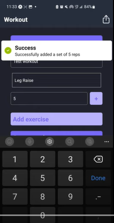

# RepLex

[](https://opensource.org/licenses/MIT)
[](https://github.com/parsa-jafarian)
[](https://www.tensorflow.org/js)

A mobile fitness application that uses real-time pose estimation with TensorFlow.js to automatically count exercise repetitions, acting as a personal AI workout tracker.

---

[DEVPOST - JACHacks 1st Place Overall Winner!](https://devpost.com/software/replex)




---

## Table of Contents

- [RepLex](#replex)
  - [Table of Contents](#table-of-contents)
  - [About The Project](#about-the-project)
  - [Key Features](#key-features)
  - [Tech Stack](#tech-stack)
  - [Architecture \& Design](#architecture--design)
  - [Getting Started](#getting-started)
    - [Prerequisites](#prerequisites)
    - [Installation](#installation)
  - [Usage](#usage)
  - [Technical Challenges \& Lessons Learned](#technical-challenges--lessons-learned)
  - [Future Improvements](#future-improvements)
  - [License](#license)

## About The Project

RepLex addresses a common hassle for fitness enthusiasts: manually counting repetitions and sets during a workout. This can be distracting, prone to error, and makes it difficult to focus purely on form and exertion.

This project leverages on-device machine learning to transform a smartphone into an intelligent workout partner. By using the camera, RepLex analyzes the user's body position in real-time to accurately count reps for various exercises. Users can create their own custom workout routines, select an exercise, and let the AI handle the counting, providing a seamless and focused training experience.

## Key Features

*   **AI-Powered Rep Counting:** Utilizes the TensorFlow.js MoveNet model for real-time human pose estimation to automatically detect and count repetitions.
*   **Custom Workout Creation:** An intuitive interface for users to build, name, and save their own workout plans with specific exercises, sets, and reps.
*   **Persistent Local Storage:** All user-created workouts are saved directly on the device using `AsyncStorage` for quick access in future sessions.
*   **Interactive Pose Overlay:** Provides real-time visual feedback by drawing the detected skeleton over the user's body on the camera feed, confirming the AI is tracking them correctly.
*   **Cross-Platform:** Built with React Native and Expo, allowing the application to run on both iOS and Android from a single codebase.

## Tech Stack

The project is built with a modern mobile and machine learning technology stack.

*   **Frontend & Mobile Framework:**
    *   React Native
    *   Expo
*   **Machine Learning / AI:**
    *   TensorFlow.js (@tensorflow/tfjs)
    *   TensorFlow.js React Native (@tensorflow/tfjs-react-native)
    *   MoveNet Pose Detection Model (@tensorflow-models/pose-detection)
*   **State Management:**
    *   React Context API
*   **Navigation:**
    *   React Navigation (Bottom Tabs)
*   **Local Storage:**
    *   AsyncStorage
*   **UI & Components:**
    *   React Native SVG (for pose overlay)
    *   React Native Autocomplete Input

## Architecture & Design

The application follows a component-based architecture standard in React Native, with a clear separation of concerns between screens, components, and application logic.

*   **State Management:** Global state, such as the list of all workouts, the currently selected workout, and the state of the active exercise (reps/sets left), is managed using **React's Context API**. `WorkoutContext` and `ExerciseContext` provide a centralized and decoupled way for components to access and modify shared data without prop-drilling.
*   **Core AI Engine:** The `PoseCamera` component is the heart of the AI functionality. It integrates the `expo-camera` stream with the TensorFlow.js model. The camera feed is converted into tensors, which are fed into the MoveNet model for pose estimation on a frame-by-frame basis.
*   **Navigation:** A bottom tab navigator (`@react-navigation/bottom-tabs`) is used for primary navigation between the `Home`, `Workout`, and `Camera` screens, providing a standard and intuitive mobile UX.

## Getting Started

To get a local copy up and running, follow these simple steps.

### Prerequisites

*   Node.js (LTS version recommended)
*   npm or yarn package manager
*   The Expo Go app on your iOS or Android device

### Installation

1.  Clone the repository:
    ```sh
    git clone https://github.com/your-username/replex.git
    ```
2.  Navigate to the project directory:
    ```sh
    cd replex
    ```
3.  Install NPM packages:
    ```sh
    npm install
    ```
4.  Start the development server:
    ```sh
    npm start
    ```
5.  Scan the QR code with the Expo Go app on your mobile device.

## Usage

1.  **Create a Workout:** Navigate to the **Workout** screen. Here you can create a new workout plan by giving it a name and adding a series of exercises with your desired sets and reps.
2.  **Start Tracking:** Go to the **Camera** screen. Select the workout you just created from the search bar at the top.
3.  **Perform Exercise:** The first exercise in your workout will load. Position yourself in front of the camera. The app will overlay a skeleton on your body and begin counting your reps as you perform the exercise. The app automatically progresses through your sets and exercises until the workout is complete.

## Technical Challenges & Lessons Learned

This project presented several interesting technical challenges that were crucial for its success.

1.  **Challenge: Real-time Pose Estimation Performance on Mobile**
    *   **Problem:** Running a machine learning model on a live camera feed is computationally expensive and can cause significant lag and battery drain on mobile devices.
    *   **Solution:** I implemented two key optimizations. First, I selected the `SINGLEPOSE_LIGHTNING` version of the MoveNet model, which is specifically designed for high-speed performance on resource-constrained devices. Second, I implemented a frame-skipping technique within the camera's processing loop (`handleCameraStream`). Instead of analyzing every single frame, the model only processes every Nth frame, drastically reducing the computational load while still providing fluid tracking. I also used the `useIsFocused` hook from React Navigation to ensure the computationally intensive camera and model were completely inactive when the user navigated away from the screen.
    *   **Lesson Learned:** This taught me the critical balance between model accuracy and on-device performance. It solidified my understanding of mobile application lifecycles and the importance of resource management to create a smooth and efficient user experience.

2.  **Challenge: Algorithmic Repetition Counting**
    *   **Problem:** The ML model provides a continuous stream of (x, y) coordinates for body joints, but it doesn't understand the concept of a "repetition." The challenge was to translate this raw data into a reliable rep count.
    *   **Solution:** I developed a state-based algorithm that calculates the angle of key joints (e.g., the angle between the ankle, knee, and hip for squats). For each exercise, I defined specific angle thresholds for the "up" and "down" phases of the movement. The algorithm maintains an internal state (`isDown`). A rep is only counted when the user completes a full range of motion by transitioning from the "down" state to the "up" state. This prevents miscounts from small, incomplete movements.
    *   **Lesson Learned:** This was a fantastic exercise in algorithmic thinking and problem-solving. It required me to break down a complex human motion into a logical sequence of geometric conditions, giving me practical experience in applying mathematical concepts to build a core feature.

## Future Improvements

*   **Add More Exercises:** Expand the `exerciseConfigs` object to include angle definitions for a wider variety of exercises (e.g., bicep curls, overhead press).
*   **User Feedback:** Implement audio cues or haptic feedback (vibration) to notify the user upon the completion of each rep and set.
*   **Workout History & Analytics:** Add a new screen to display a history of completed workouts, allowing users to track their progress over time.
*   **Refactor to TypeScript:** Migrate the codebase from JavaScript to TypeScript to improve code quality, maintainability, and reduce runtime errors.

## License

Distributed under the MIT License. See `LICENSE` for more information.